## LDTS_<1207> - BLACKJACK

In this exiciting gambling game of 'Blackjack', we provide an engaging and strategic experience for players within the constraints of purely textual interface.

Players are dealt virtual cards, and the objective is to build a hand with a total value as close to 21 as possible without exceeding it. The game incorporates the classic rules of this iconic game, where numbered cards retain their face value, face cards are worth 10 points, and an Ace can be either 1 or 11 points. Players make decisions to hit, stand or 
double down based on their current hand and the dealer's visible card. The challenge lies in making strategic choices to beat the dealer while managing the risk of going over 21.

We also included in the game a last ten games menu, that allows us to see who here the last ten people to play and their gains and losses.

This project was developed by *Filipa Geraldes* (*up202208030*@fe.up.pt), *Filipa Fidalgo* (*up202208039*@fe.up.pt) and *Leonor Couto* (*up202205796*@fe.up.pt) for LDTS 2023/24.

### IMPLEMENTED FEATURES

- **Change selected button** - using arrow keys you can change the selected button (it's the red one).
- **Select button** - to select a button for the program to execute an action (e.g. start game, exit, etc.) you need to press enter key.

### PLANNED FEATURES

- **Change selected coin** - using arrow keys you can change the selected coin.
- **Increase the value of the bet** - after choosing a coin, press enter key to increase the bet.
- **Decrease the value of the bet** - after choosing a coin, press backspace key to decrease the bet.
- **Chose how many decks** - in a menu the user is presented with 3 options, to play with one deck, two decks, or the infinite mode.
- **Chose the move** - the user can choose between hit, stand or double down.

### MOCKUPS

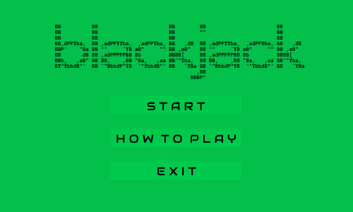
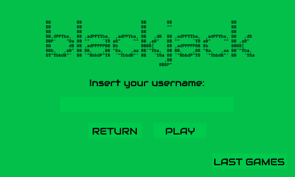
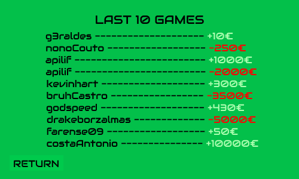
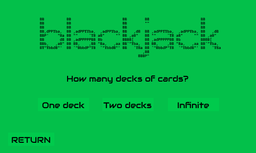
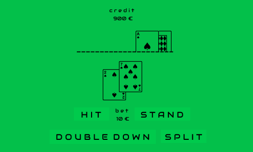
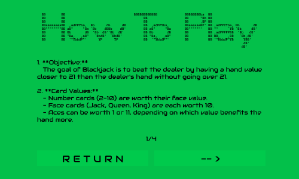
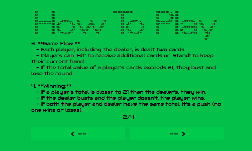
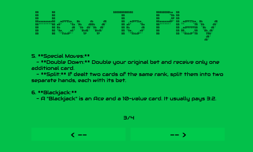
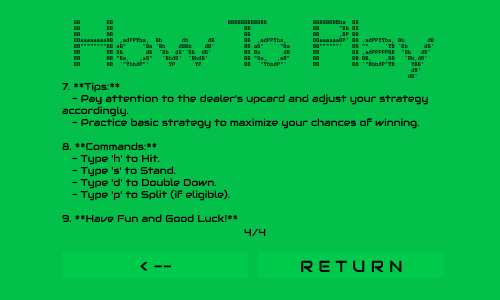
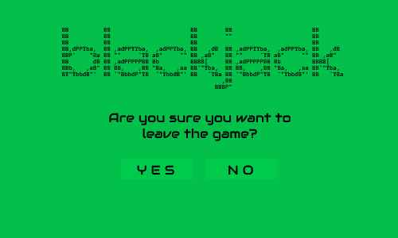

### UML
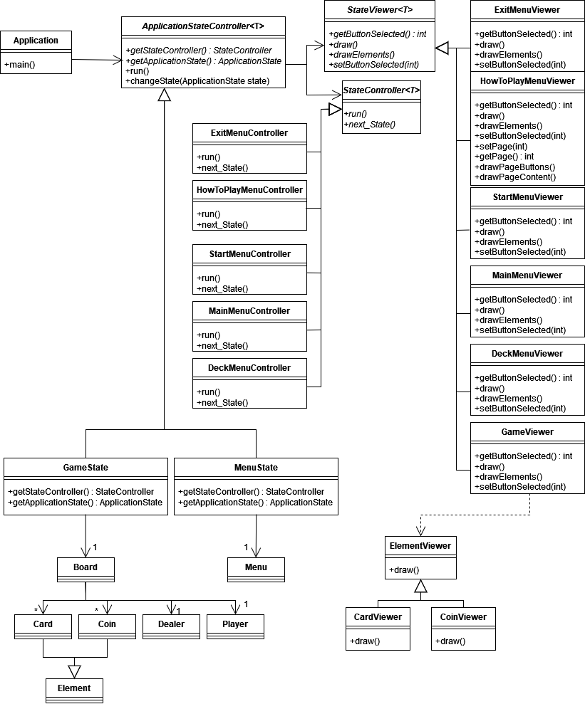

### DESIGN

#### WE AIM TO DISTINCTIVELY SEPARATE THE UNDERLYING DATA STRUCTURES AND LOGIC FROM  HOW INFORMATION IS DISPLAYED TO THE USER AND HOW USER INPUTS ARE RECEIVED.

**Problem in Context**

To further organize our code, improve maintainability and enhance readability, we decided to use the Model-View-Controller pattern,
dividing our code in three different parts.

**The Pattern**

We have applied the **Model-View-Controller** (MVC) pattern.
This architectural design pattern provides a structured approach to organizing our application, promoting modularity and maintainability.

**Implementation:**

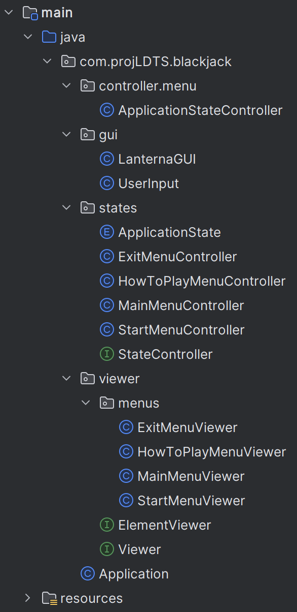

**Consequences** 

The use of the Model-View-Controller (MVC) pattern in the current design offers several advantages:

- Separation of Concerns 

    - MVC separates data (Model), presentation (View), and application logic (Controller), promoting a modular and organized code.

- Code Organization

    - The pattern enhances code organization, making it easier to understand, modify, and extend specific parts of the application without affecting others.

- Improved Readability

    - MVC reduces the need for complex conditional statements, enhancing code readability by providing a well-defined structure.

- Maintainable Scalability

    - MVC supports scalable development, allowing the introduction of new components without disrupting the existing code.

- Explicit Representation

    - Each MVC component explicitly represents its role, aiding developers in understanding and navigating the codebase.

#### We aim to simplify the process of transitioning between various game menus and play states, making it effortless to switch between different aspects of the game.

**Problem Context**

We faced complexity managing various game states and menus, so we needed a straightforward and efficient method for seamless navigation between these diverse elements.

**The Pattern**

We applied the **State** pattern. This design allows each game state to be represented by a separate subclass, enabling smooth transitions between various phases like betting and playing. This approach simplifies the management of different game states, addressing our identified challenges effectively.

**Implementation:**

**Consequences**

By using the State design pattern we ensure that: 
- Each game state is neatly organized with its own class, contributing to a well-structured code. 
- The pattern allows effortless addition of new states without disrupting the code of existing states, ensuring flexibility in expanding game features. 
- Massive conditional statements are avoided, keeping the code simple and readable.

#### KNOWN CODE SMELLS

For now, we believe that we don't have any known code smells.

### TESTING

- Not implemented yet.

### SELF-EVALUATION

- Filipa Geraldes: 33,3%
- Filipa Fidago: 33,3%
- Leonor Couto: 33,3%