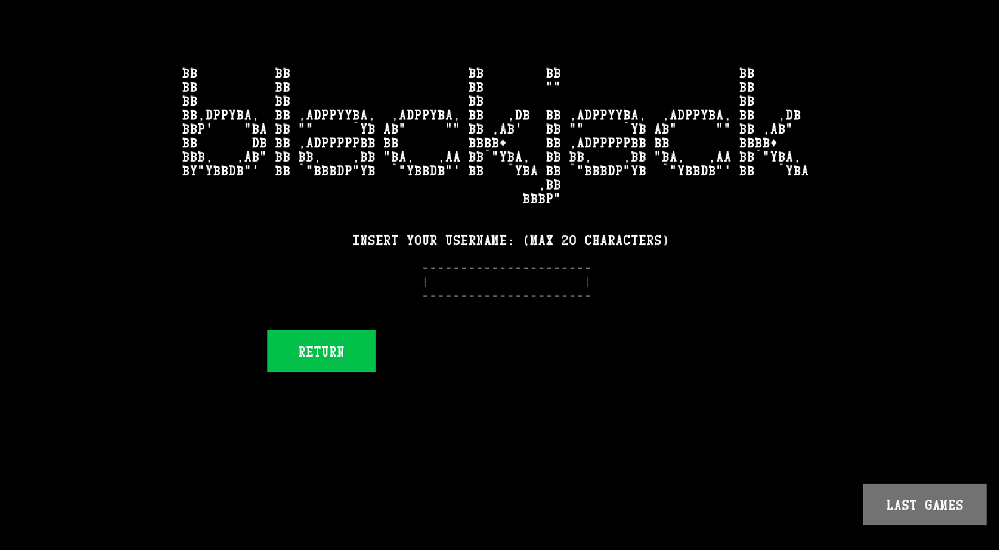

## LDTS_<1207> - BLACKJACK

### GAME DESCRIPTION

In this exiciting gambling game of **'Blackjack'**, we provide an engaging and strategic experience for players within the constraints of purely textual interface.

Players are dealt virtual cards, and the objective is to build a hand with a total value as close to 21 as possible without exceeding it. The game incorporates the classic rules of this iconic game, where numbered cards retain their face value, face cards are worth 10 points, and an Ace can be either 1 or 11 points. Players make decisions to hit, stand or
double down based on their current hand and the dealer's visible card. The challenge lies in making strategic choices to beat the dealer while managing the risk of going over 21.

We also included in the game a last ten games menu, that allows us to see who here the last ten people to play and their gains and losses.

This project was developed by *Filipa Geraldes* (*up202208030*@fe.up.pt), *Filipa Fidalgo* (*up202208039*@fe.up.pt) and *Leonor Couto* (*up202205796*@fe.up.pt) for LDTS 2023/24.

For a more detailed version of this description click [here](./docs/README.md).

### FEATURES

- **Change selected button** - using arrow keys you can change the selected button (it's the red one).
- **Select button** - to select a button for the program to execute an action (e.g. start game, exit, etc.) you need to press enter key.
- **Insert username and bet** - in start menu the user can write the username using alpha keys and when ready presses enter key, in the game the user write the bet using numerical keys and then presses the enter key so the game can start.
- **Chose how many decks** - in a menu the user is presented with 3 options, to play with one deck, two decks, or the infinite mode.
- **Chose the move** - the user can choose between hit, stand or double down.
- **Hit** - gives the player another card from the deck.
- **Stand** - the player has finished the move and gives the dealer's turn to play.
- **Double down** - gives the player another card from the deck and double the bet.
- **Game Over** - the player has no credit left, the player can quit the game or reset the credit to 1000.
- **Player won** - when player chooses stand and the dealer's hand has a value bigger than 21.
- **Player lost** - when player chooses hit or double down and the player's hand becomes bigger than 21 or the player chooses stand and dealer's hand is bigger than the player's hand and smaller or equal to 21.
- **Draw** - when player chooses stand and dealer's hand has the same value.
- **Save game information** - for each play the game saves the username and the value won or lost in a csv file.
- **Display last 10 games** - the user can access the last 10 games in the program.

### GAME PREVIEW

### MOCKUPS
**Main Menu**

**Start Menu**

**Last 10 Games**

**Decks Menu**

**Choosing Bet**

**Playing**

**Player Lost**

**Player Won**

**No Credit Left**

**How To Play**

**Exit Menu**

