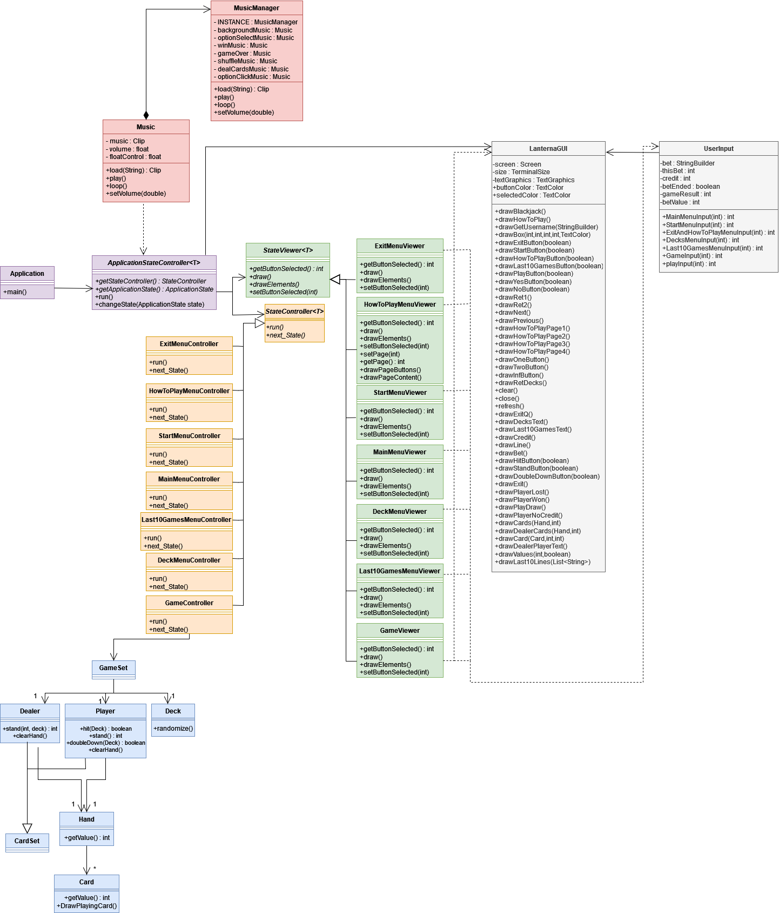
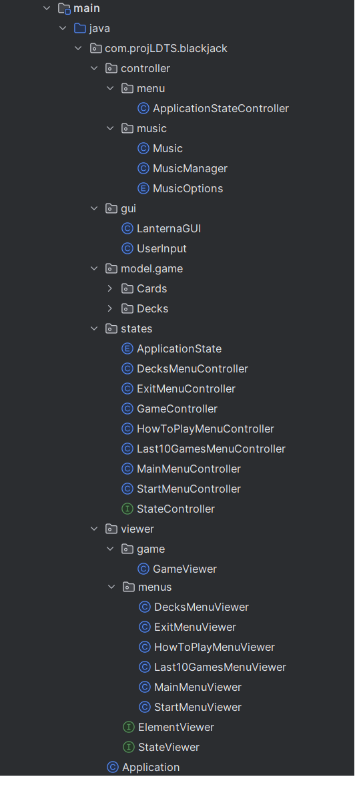
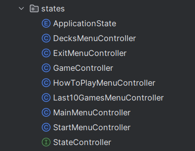
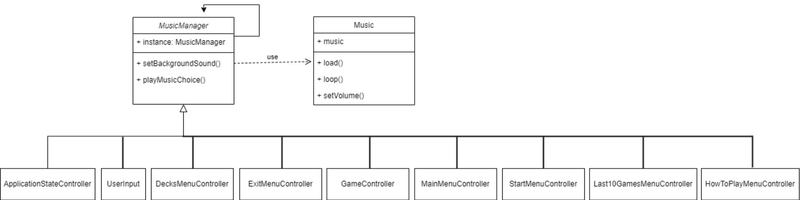
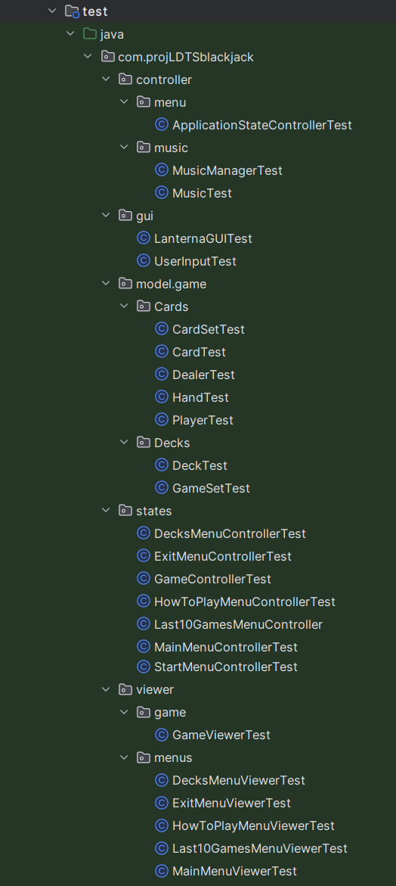
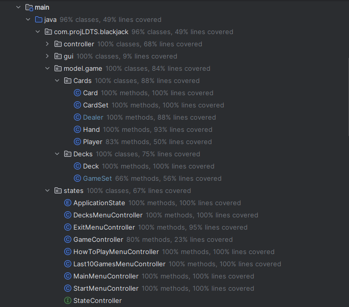

## LDTS_<1207> - BLACKJACK

In this exciting gambling game of 'Blackjack', we provide an engaging and strategic experience for players within the constraints of purely textual interface.

Players are dealt virtual cards, and the objective is to build a hand with a total value as close to 21 as possible without exceeding it. The game incorporates the classic rules of this iconic game, where numbered cards retain their face value, face cards are worth 10 points, and an Ace can be either 1 or 11 points. Players make decisions to hit, stand or
double down based on their current hand and the dealer's visible card. The challenge lies in making strategic choices to beat the dealer while managing the risk of going over 21.

We also included in the game a last ten games menu, that allows us to see who here the last ten people to play and their gains and losses.

This project was developed by *Filipa Geraldes* (*up202208030*@fe.up.pt), *Filipa Fidalgo* (*up202208039*@fe.up.pt) and *Leonor Couto* (*up202205796*@fe.up.pt) for LDTS 2023/24.

## FEATURES
### IMPLEMENTED FEATURES
- **Change selected button** - using arrow keys you can change the selected button (it's the red one).
- **Select button** - to select a button for the program to execute an action (e.g. start game, exit, etc.) you need to press enter key.
- **Insert username and bet** - in start menu the user can write the username using alpha keys and when ready presses enter key, in the game the user write the bet using numerical keys and then presses the enter key so the game can start.
- **Chose how many decks** - in a menu the user is presented with 3 options, to play with one deck, two decks, or the infinite mode.
- **Chose the move** - the user can choose between hit, stand or double down.
- **Card Information** - stores the suit, rank, and graphical representation of the playing card. 
- **Value Calculation** - calculates and returns the numerical value of the card based on its rank.
- **Dealing Cards** - the game will deal two cards to the player at the start of the round.
- **Hit** - gives the player another card from the deck.
- **Stand** - the player has finished the move and gives the dealer's turn to play.
- **Double down** - gives the player another card from the deck and double the bet.
- **Game Over** - the player has no credit left, the player can quit the game or reset the credit to 1000.
- **Player won** - when player chooses stand and the dealer's hand has a value bigger than 21.
- **Player lost** - when player chooses hit or double down and the player's hand becomes bigger than 21 or the player chooses stand and dealer's hand is bigger than the player's hand and smaller or equal to 21.
- **Draw** - when player chooses stand and dealer's hand has the same value.
- **Placing Bets** - the player can place a bet by entering a specific amount before the round begins. Supports backspace for correction and limits the bet to 6 digits.
- **Adjusting Credits** - depending on the outcome, the player's credits are adjusted. Winning a round may increase their credits, while losing decreases them.
- **Next Round** - the game allows the player to start a new round, placing a new bet and continuing the gameplay.
- **Save game information** - for each play the game saves the username and the value won or lost in a csv file.
- **Background Music** - the background music, initialized with a file path to "background_music.wav," creates a pleasant ambiance during gameplay.
- **Music Selection** - different music tracks are available for specific in-game events. For example:
- **Option Selection** - a distinct sound is played when a player selects an option. This adds responsiveness to user actions and enhances the interactive feel of the game.
- **Option Click Music** - when a player successfully clicks on an option, the "select_successfully.wav" track plays, providing auditory feedback for the action.
- **Win Music** - when a player achieves victory, the "win.wav" music track is played, celebrating their success.
- **Game Over Music** - the "game_over.wav" track is triggered when the game concludes, providing an audio cue for the end of the gaming session.
- **Card-related Sounds** - the "card_shuffle.wav" track is played during the shuffling of cards, adding realism to the card game environment. The "dealing_card.wav" track is used to signify the dealing of cards, contributing to the immersive gameplay experience.
- **Adjusting Credits** - depending on the outcome, the player's credits are adjusted. Winning a round may increase their credits, while losing decreases them.
- **Next Round** - the game allows the player to start a new round, placing a new bet and continuing the gameplay.
- **Display last 10 games** - the user can access the last 10 games in the program.

### PLANNED FEATURES
- All features were implemented.

## UML

## DESIGN

#### WE AIM TO DISTINCTIVELY SEPARATE THE UNDERLYING DATA STRUCTURES AND LOGIC FROM  HOW INFORMATION IS DISPLAYED TO THE USER AND HOW USER INPUTS ARE RECEIVED.

**Problem in Context**

To further organize our code, improve maintainability and enhance readability, we decided to use the Model-View-Controller pattern,
dividing our code in three different parts.

**The Pattern**

We have applied the **Model-View-Controller** (MVC) pattern.
This architectural design pattern provides a structured approach to organizing our application, promoting modularity and maintainability.

**Implementation:**

**Consequences**

The use of the Model-View-Controller (MVC) pattern in the current design offers several advantages:

- Separation of Concerns

    - MVC separates data (Model), presentation (View), and application logic (Controller), promoting a modular and organized code.

- Code Organization

    - The pattern enhances code organization, making it easier to understand, modify, and extend specific parts of the application without affecting others.

- Improved Readability

    - MVC reduces the need for complex conditional statements, enhancing code readability by providing a well-defined structure.

- Maintainable Scalability

    - MVC supports scalable development, allowing the introduction of new components without disrupting the existing code.

- Explicit Representation

    - Each MVC component explicitly represents its role, aiding developers in understanding and navigating the codebase.

#### We aim to simplify the process of transitioning between various game menus and play states, making it effortless to switch between different aspects of the game.

**Problem Context**

We faced complexity managing various game states and menus, so we needed a straightforward and efficient method for seamless navigation between these diverse elements.

**The Pattern**

We applied the **State** pattern. This design allows each game state to be represented by a separate subclass, enabling smooth transitions between various phases like betting and playing. This approach simplifies the management of different game states, addressing our identified challenges effectively.

**Implementation:**

**Consequences**

By using the State design pattern we ensure that:
- Each game state is neatly organized with its own class, contributing to a well-structured code.
- The pattern allows effortless addition of new states without disrupting the code of existing states, ensuring flexibility in expanding game features.
- Massive conditional statements are avoided, keeping the code simple and readable.

#### We aim to centralize audio resources.

**Problem Context**

Handling sound effects independently in each class was impractical, as it would complicate management and adaptability. Additionally, the need for uninterrupted background music underscored the necessity for a centralized solution. 

**The Pattern**

We applied the **Singleton** pattern. This design guarantees the creation of an instance of the class responsible for managing music and sound effects, and this instance is accessible universally. 

**Implementation:**

These classes can be found in the following files:
- [Music](src/main/java/com/projLDTS/blackjack/controller/music/Music.java)
- [MusicManager](src/main/java/com/projLDTS/blackjack/controller/music/MusicManager.java)
- [MusicOptions](src/main/java/com/projLDTS/blackjack/controller/music/MusicOptions.java)

**Consequences**

By using the Singleton design pattern we ensure that:
- The code becomes isolated from the intricacies of music and sound effects management.
- With only one instance of the class in existence, the risk of simultaneous playback of multiple background musics is eradicated. This ensures a seamless audio experience without unwanted overlaps.
- Altering music tracks and sound effects becomes a straightforward task. With a single class handling these elements, modifications are centralized, simplifying the process and promoting maintainability.

### KNOWN CODE SMELLS

In our game, audio elements like sounds and music are stored in .wav files. To avoid delays in sound effects caused by loading each file before playing, we opted to preload all sounds in the MusicManager class. However, a challenge arose – the MusicManager class became burdened with numerous switch statements, each dedicated to playing a specific sound effect. Extensive use of switch statements is generally discouraged, and this case is no exception. The presence of numerous cases in this scenario contributes to a code smell, indicating that a more streamlined and maintainable approach is needed.

## TESTING

## TEST COVERAGE

## SELF-EVALUATION

- Filipa Geraldes: 33,3%
- Filipa Fidago: 33,3%
- Leonor Couto: 33,3%